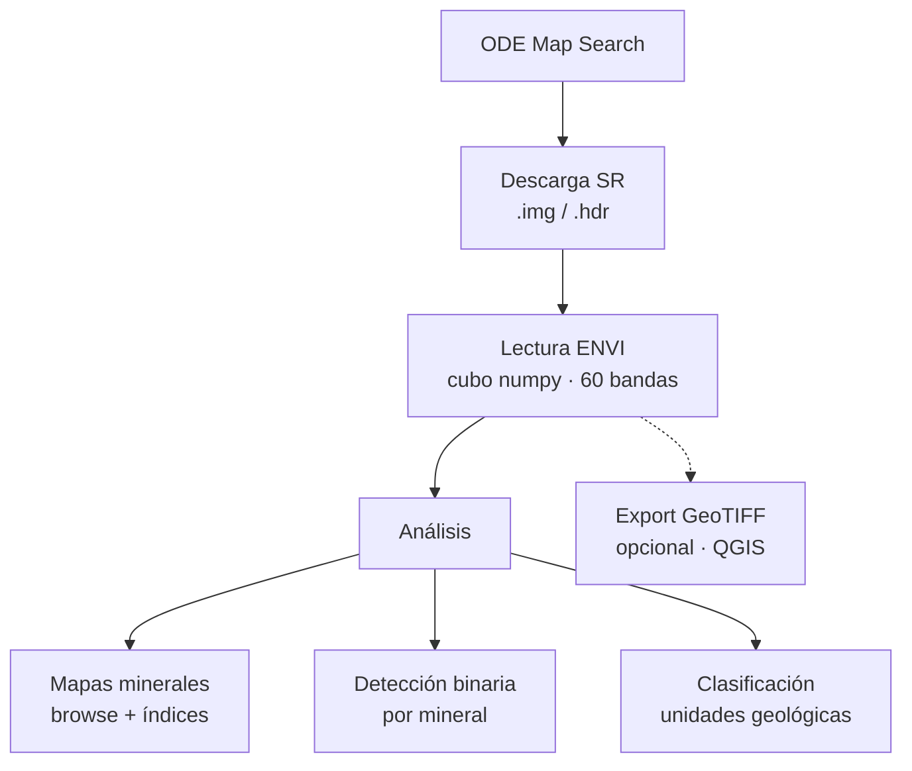

# 1. Conceptos fundamentales

Este documento introduce los conceptos necesarios para usar el pipeline CRISM MTRDR SR.

## 1.1 CRISM y MRO

**CRISM** (Compact Reconnaissance Imaging Spectrometer for Mars) es un espectrómetro hiperespectral a bordo del **Mars Reconnaissance Orbiter (MRO)**. Mide la radiancia reflejada por la superficie marciana en cientos de bandas espectrales (VNIR + IR), lo que permite identificar minerales por sus firmas de absorción.

## 1.2 Productos de datos CRISM

Los datos pasan por varios niveles de procesamiento:

| Producto | Descripción |
|----------|-------------|
| **EDR/TRDR** | Datos calibrados a radiancia o I/F |
| **TER** | Corrección empírica (atmósfera, geometría, artefactos) |
| **MTRDR** | TER mapa-proyectado; incluye cubo IF y productos derivados |
| **SU** | Summary Parameters — 60 índices espectrales calculados del cubo IF |
| **SR** | **Refined** Summary Parameters — versión con mitigación de ruido |
| **BR** | Browse products — composiciones RGB de índices temáticos |

Este pipeline trabaja exclusivamente con **SR**, la versión recomendada para interpretación mineralógica.

## 1.3 Índices Viviano-Beck et al. (2014)

Viviano-Beck et al. definieron **60 parámetros espectrales** (band depth, índices, ratios) que cuantifican absorciones diagnósticas de minerales en Marte. Cada parámetro es una **banda** del cubo SR.

Ejemplos:

| Índice | Significado |
|--------|-------------|
| `OLINDEX3` | Absorción amplia ~1 μm → olivina, filosilicatos Fe |
| `LCPINDEX2` | Piroxeno bajo calcio |
| `HCPINDEX2` | Piroxeno alto calcio |
| `D2300` | Caída espectral 2.3 μm → filosilicatos, carbonatos |
| `BD1900_2` | Agua ligada en minerales hidratados |
| `BD2100_2` | Sulfatos monohidratados |
| `BD2500H2` | Carbonatos de Mg |

Referencia: [doi:10.1002/2014JE004627](https://doi.org/10.1002/2014JE004627)

## 1.4 Browse products

Los **browse products** son imágenes RGB formadas por tres índices temáticos estirados a 8 bits. Permiten evaluar rápidamente la diversidad mineralógica de una escena.

| Código | Tema | Canales RGB |
|--------|------|-------------|
| **MAF** | Mineralogía máfica | OLINDEX3, LCPINDEX2, HCPINDEX2 |
| **PHY** | Filosilicatos | D2300, D2200, BD1900r2 |
| **HYD** | Minerales hidratados | SINDEX2, BD2100_2, BD1900_2 |
| **CAR** | Carbonatos | D2300, BD2500H2, BD1900_2 |
| **FEM** | Minerales de Fe | BD530_2, SH600_2, BDI1000VIS |

La lista completa está en `config/viviano2014.yaml`.

## 1.5 Limitaciones importantes

1. **No cuantitativo**: la intensidad de un índice no equivale a abundancia mineral.
2. **No único**: varios minerales pueden activar el mismo índice.
3. **Dependiente de escena**: los umbrales óptimos varían entre observaciones.
4. **Validación**: siempre contrastar detecciones con espectros del cubo IF y contexto geológico.

## 1.6 Flujo conceptual del pipeline

