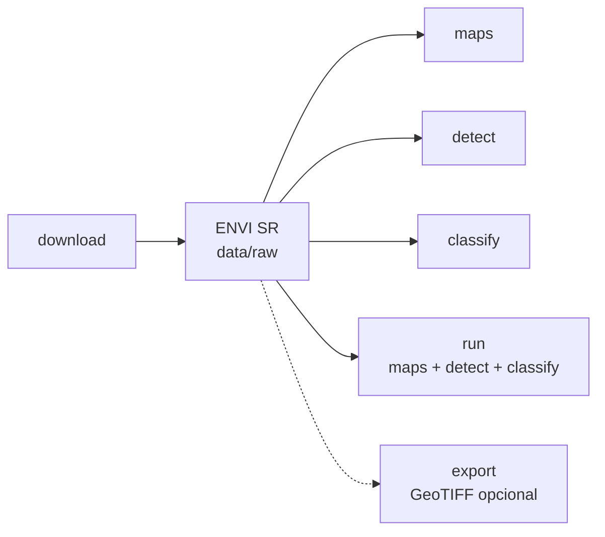
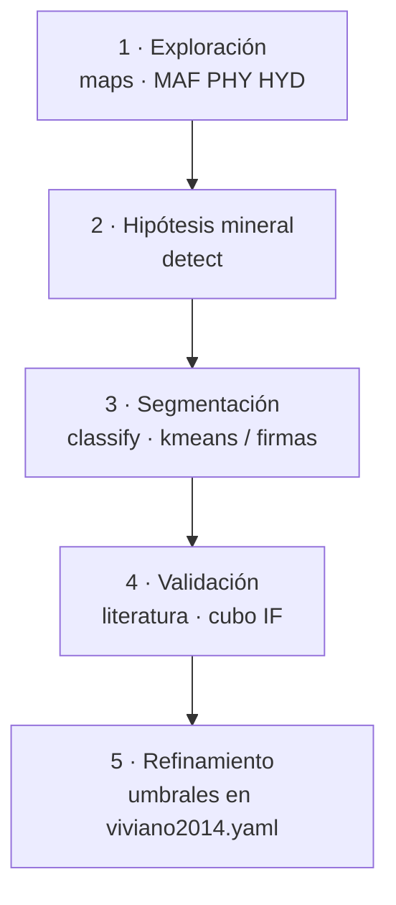

# 4. Pipeline de procesamiento

## 4.1 Visión general

El pipeline transforma cubos SR (ENVI) en productos analíticos. El flujo principal **no requiere** conversión intermedia:



## 4.2 Paso `export` (opcional): ENVI → GeoTIFF

Copia el cubo a GeoTIFF para GIS (p. ej. QGIS). El análisis (`maps` / `detect` / `classify` / `run`) trabaja directo sobre ENVI.

```bash
python -m crism_pipeline export --input data/raw/frt00009001_07_if163j_mtr3
```

**Entrada:** directorio con `.hdr/.img` SR, o ruta directa al `.hdr`.

**Salida:** `data/processed/<PRODUCT_ID>.tif` (y, si se usa la API, también es posible HDF5 vía biblioteca).

| Contenido | Descripción |
|-----------|-------------|
| Bandas | Índices Viviano (nombres en metadata) |
| CRS | Aproximado desde `map info` del header ENVI |

## 4.3 Lectura programática

```python
from pathlib import Path
from crism_pipeline.io_sr import load_sr_cube, load_cube

# Desde ENVI (recomendado)
cube = load_sr_cube(Path("data/raw/mi_escena"))

# ENVI o HDF5 legado
cube = load_cube(Path("data/processed/mi_escena.h5"))

# Acceder a un índice
olivine = cube.band("OLINDEX3")
print(cube.band_names)  # lista de 60 índices
print(cube.valid_mask.sum())  # píxeles válidos
```

## 4.4 Comando `run`: pipeline completo

Ejecuta maps + detect + classify en una sola invocación (sobre el cubo ENVI):

```bash
python -m crism_pipeline run \
  --input data/raw/frt00009001_07_if163j_mtr3 \
  --method kmeans \
  --n-clusters 5
```

**Salidas en** `data/maps/<product_id>/`:

```
maps/<product_id>/
├── browse/           # MAF.png, PHY.png, ...
├── indices/          # mapas de índice individual
├── detection/        # máscaras binarias por mineral
└── classification/   # mapa de unidades + metadatos
```

## 4.5 Flujo recomendado para investigación



1. **Exploración:** `maps` con browse MAF, PHY, HYD
2. **Hipótesis mineral:** `detect` sobre minerales candidatos
3. **Segmentación:** `classify` con K-means o firmas
4. **Validación:** contrastar con literatura y cubo IF si es necesario
5. **Refinamiento:** ajustar umbrales en `viviano2014.yaml`

## 4.6 Formatos de salida

| Formato | Uso |
|---------|-----|
| `.png` | Visualización rápida |
| `.tif` | GeoTIFF (si hay `map info` en header) |
| `.h5` | Cubo legado / API de biblioteca |
| `.json` | Metadatos de clasificación |
| `.joblib` | Modelo entrenado (supervisado/K-means) |

## 4.7 Integración con GIS

Los GeoTIFF generados (o el `.IMG` ENVI) pueden abrirse en QGIS. Si el header ENVI incluye `map info`, el pipeline escribe CRS EPSG:4326 y geotransform aproximado.

Para análisis preciso en proyección MRO, consulta el label PDS asociado al producto MTRDR.
