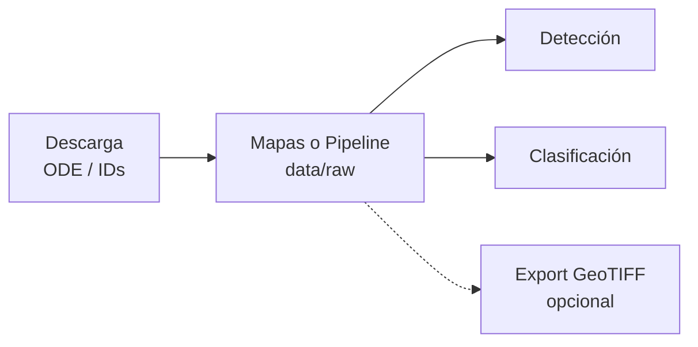

# 8. Manual de la interfaz gráfica (GUI)

Interfaz del **CRISM Pipeline** para el **GCPA** (Grupo de investigación en Ciencias Planetarias y Astrobiología).  
Hace lo mismo que los comandos de terminal, sin reemplazarlos.

## 8.1 Cómo abrirla

Desde la carpeta del proyecto:

```powershell
cd C:\Users\57319\Documents\2026\Semillero
.venv\Scripts\activate
$env:PYTHONPATH='src'
python -m crism_pipeline.gui
```

O, si el paquete está instalado (`pip install -e .`):

```powershell
crism-pipeline-gui
```

## 8.2 Qué verás

| Zona | Función |
|------|---------|
| **Cabecera GCPA** | Logo y nombre del grupo; accesos rápidos a Manual y Conceptos |
| **Pestañas** | Descarga, Exportar, Mapas, Detección, Clasificación, Espectros IF, Pipeline, Ayuda |
| **CLI equivalente** | Comando de terminal listo para copiar |
| **Barra de progreso** | Porcentaje y detalle del archivo/escena en curso |
| **Registro** | Mensajes y errores de la tarea |

## 8.3 Flujo recomendado



1. **Descarga** — archivo SearchResults de ODE (p. ej. `CRISM2 (1).txt`) o Product ID / bbox.  
2. **Mapas** o **Pipeline** — sobre un directorio en `data/raw/…` (botón **Raw**).  
3. **Detección** / **Clasificación** — según el estudio.  
4. **Exportar** — solo si necesitas GeoTIFF para QGIS (opcional).

El flujo principal trabaja con **ENVI** (`.img` / `.hdr`) en `data/raw`. No hace falta convertir a HDF5.

## 8.4 Pestañas

### Descarga
- **SearchResults / IDs**: CSV de ODE o un ID por línea.
- **Product ID**: un `pdsid` o patrón con `*`.
- **Bounding box**: W E S N en grados.
- **Datos**: solo SR, solo IF, o ambos (`--data sr|if|both`).
- La barra muestra el **% del archivo actual** y el avance entre escenas (`[2/6] …`).
- Si la red se corta, puedes **volver a lanzar**: reanuda lo incompleto.

### Exportar
Copia GeoTIFF opcional a `data/processed`.

### Mapas
Browse products (MAF, PHY, HYD, …) + mapas de índices. Salida en `data/maps`.

### Detección
Máscaras binarias por mineral (umbrales adaptativos Viviano). Vacío = todos.

### Clasificación
`kmeans`, `signature` o `supervised` (CSV de píxeles de entrenamiento).

### Espectros IF
Explora el cubo **I/F** hiperespectral (no el browse SR):

1. Elige el directorio del producto IF (`…` o botón **IF** = solo carpetas con cubo IF en `data/raw`).
2. **Cargar IF** — vista previa RGB + media espectral de la escena.
3. Clic en la imagen **o** escribe **Line** / **Sample** (índices 0-based) y **Espectro píxel**.
4. Activa/desactiva **Mostrar píxel** y **Mostrar media** en el gráfico.
5. **Exportar CSV…** — una fila por longitud de onda (`wavelength_nm`, `i_f_pixel`, `i_f_mean`, coords, `product_id`).

Requiere haber descargado IF (`Datos: IF` o `ambos` en la pestaña Descarga).

### Pipeline
Encadena maps → detect → classify en `data/maps/<PRODUCT_ID>/`.

### Ayuda
Lista la documentación. **Ver** abre el texto en una ventana; **Abrir** lo abre con el programa asociado (p. ej. Cursor/VS Code).

## 8.5 Documentación relacionada

| Documento | Contenido |
|-----------|-----------|
| [01_conceptos.md](01_conceptos.md) | CRISM, MTRDR, SR, índices Viviano |
| [02_instalacion.md](02_instalacion.md) | Entorno y dependencias |
| [03_descarga.md](03_descarga.md) | ODE REST y archivos SR |
| [04_pipeline_procesamiento.md](04_pipeline_procesamiento.md) | Flujo general |
| [05_mapas_minerales.md](05_mapas_minerales.md) | Browse e índices |
| [06_deteccion_minerales.md](06_deteccion_minerales.md) | Reglas de detección |
| [07_clasificacion_unidades.md](07_clasificacion_unidades.md) | Métodos de clasificación |

## 8.6 Relación con el CLI

La GUI **no cambia** los subcomandos:

```text
python -m crism_pipeline download|export|maps|detect|classify|run …
```

Copia el comando de la barra inferior si quieres reproducir el mismo paso en terminal o en un script.

## 8.7 Tecnología de la GUI

Se eligió **CustomTkinter** (sobre tkinter):

| Opción | Pros | Contras |
|--------|------|---------|
| **CustomTkinter** (elegida) | Aspecto moderno, nativa, fácil progreso, poco peso | Dependencia extra (`customtkinter`, `Pillow`) |
| tkinter puro | Ya viene con Python | Aspecto “rígido” / antiguo |
| PyQt / PySide | Muy pulido | Más pesado; licencias |
| Streamlit / Gradio | Rápido de prototipar | Navegador; menos cómodo para descargas largas locales |

## 8.8 Problemas frecuentes

| Síntoma | Qué hacer |
|---------|-----------|
| `No module named 'crism_pipeline'` | Activa el venv y/o ` $env:PYTHONPATH='src'` |
| `No module named 'customtkinter'` | `.venv\Scripts\pip install customtkinter pillow` |
| Descarga incompleta / `retrieval incomplete` | Relanzar la descarga; reanuda el archivo |
| GUI “ocupada” | Espera a que termine la tarea actual |

## 8.9 Créditos

Pipeline CRISM MTRDR SR — índices [Viviano-Beck et al. (2014)](https://doi.org/10.1002/2014JE004627).  
Interfaz y branding: **GCPA**. Datos: NASA PDS / ODE.
